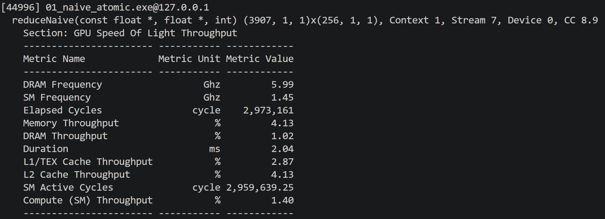
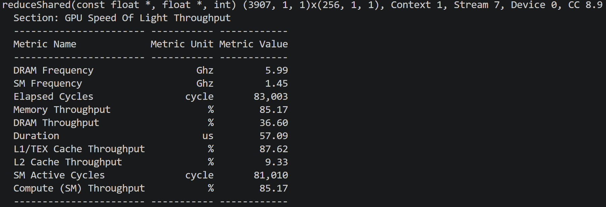
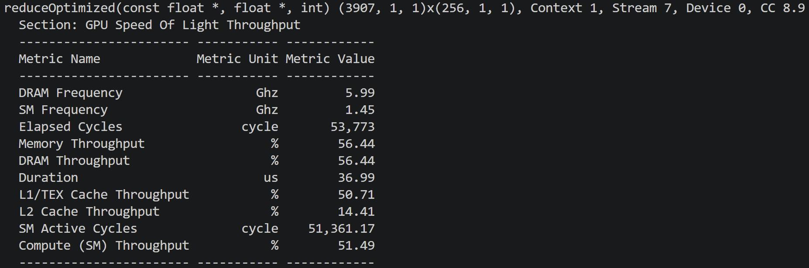
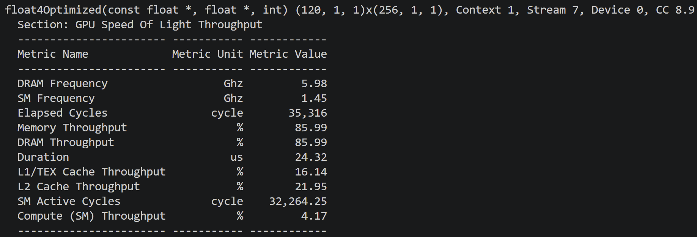

# CUDA Parallel Reduction — A Profiling-Driven Optimization Study

Optimizing a 1M-element float array sum on an NVIDIA RTX 2000 Ada (Ada Lovelace, CC 8.9),
using Nsight Compute to identify each bottleneck before fixing it.

## Results

| Stage | Kernel | Duration | DRAM % | L1 % | Speedup |
|-------|--------|----------|--------|------|---------|
| 1 | Naive global atomics | 2050 µs | — | — | 1× |
| 2 | Shared-memory tree | 56.8 µs | 37% | 88% | 36× |
| 3 | Grid-stride + warp shuffle | 36.8 µs | 56% | 51% | 56× |
| 4 | Vectorized float4 loads | 24.3 µs | 86% | 16% | 84× |

## The optimization journey

**1. Naive (2050 µs).** One `atomicAdd` per element to a single global address.

~1M threads serialize on one contended location — a pure contention bottleneck.

**2. Shared-memory tree (56.8 µs, 36×).** Per-block reduction in shared memory with one
atomic per block. Nsight revealed the new bottleneck: **L1 at 88%, DRAM only 37%** 

— the kernel was limited by shared-memory traffic and `__syncthreads` overhead, not bandwidth.

**3. Grid-stride + warp shuffle (36.8 µs, 56×).** Each thread sums multiple elements
(coalesced grid-stride loads), and the final 32 elements reduce via `__shfl_down_sync`,
eliminating shared memory and barriers for the last warp. 

DRAM rose 37% → 56% as the bottleneck shifted toward memory.

**4. Vectorized float4 loads (24.3 µs, 84×).** Each thread loads 128 bits (four floats)
per instruction. **DRAM throughput reached 86%**

— the practical ceiling for a memory-bound
reduction, with compute idle at 7%.

## Confirming the ceiling

Nsight's Launch Statistics flagged a tail effect (1.78 waves/SM) with an estimated 50%
headroom. Tuning the grid to a single wave (120 blocks, 0.83 waves/SM) produced **no
measurable improvement** — because the kernel is DRAM-bandwidth-bound at 86%, so idle-SM
effects are second-order. This confirmed the 86% figure is the true hardware ceiling, not
a launch-configuration artifact.

## Build & profile

\`\`\`bash
nvcc -arch=sm_89 04_float4_vectorized.cu -o 04_float4_vectorized
ncu --set full -o report ./04_float4_vectorized   # profile with Nsight Compute
\`\`\`

## Key takeaway

Every optimization was chosen from profiler evidence, not guessed — and the final stage
verifies the ceiling by testing (and ruling out) the profiler's last suggestion. The
bottleneck moved from atomic contention → shared-memory/sync overhead → DRAM bandwidth,
which is the correct terminal state for a reduction.