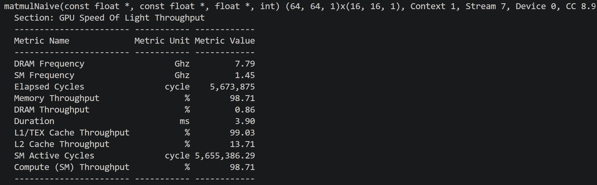
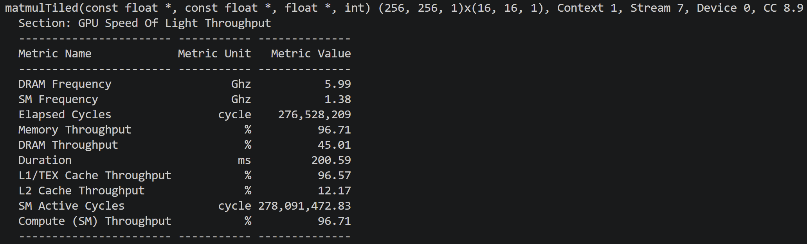
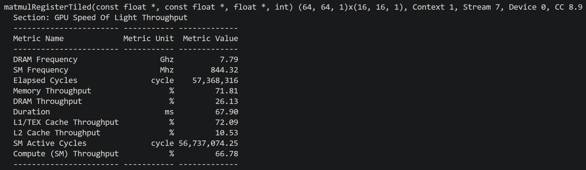
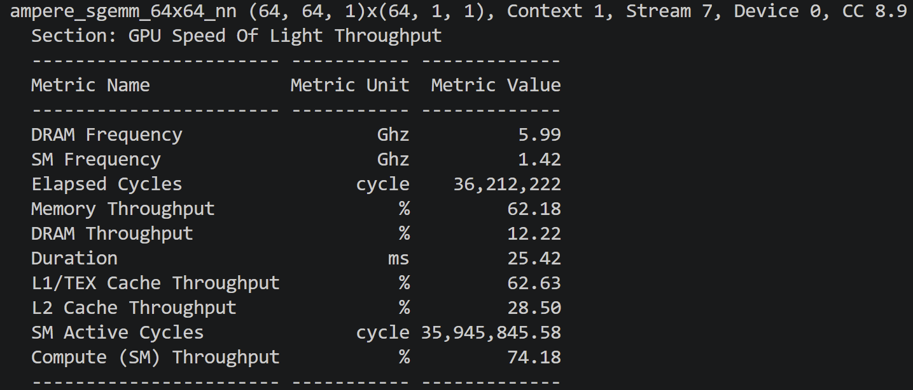

# CUDA Matrix Multiplication — A Profiling-Driven Optimization Study

Optimizing a single-precision square GEMM (C = A × B) on an NVIDIA RTX 2000 Ada
(Ada Lovelace, CC 8.9), using **Nsight Compute** to drive each step. Benchmarked at
**N = 4096** (a 4096³ matmul ≈ 137 GFLOP), validated against **cuBLAS**.

This is the **compute-bound mirror** of the [reduction study](../reduction/): where the
reduction climbed *to* the DRAM bandwidth ceiling, matmul climbs *away* from memory toward
the compute ceiling — by reusing data harder at each level of the memory hierarchy.

## Results (N = 4096)

| Stage | Kernel | Duration | L1 % | Compute % | DRAM % | Occupancy | vs cuBLAS |
|-------|--------|----------|------|-----------|--------|-----------|-----------|
| 1 | Naive (one thread / output) | 342 ms | 99% | 99% | 20% | ~100% | 0.07× |
| 2 | Shared-memory tiled | 200 ms | 97% | 97% | 45% | ~100% | 0.13× |
| 3 | **Register tiled (4×4)** | **46 ms** | 72% | 67% | 41% | 50% | **0.55×** |
| — | Register tiled (8×8) | 54.6 ms | 95% | 50% | 35% | 33% | 0.46× |
| — | **cuBLAS** (`ampere_sgemm_64x64`) | **25 ms** | 63% | 74% | 12% | 33% | 1.00× |

The bottleneck climbs the memory hierarchy: **redundant global reads → shared-memory
throughput → (relieved by register reuse) → balanced compute/memory.**

## The optimization journey

### Stage 1 — Naive: one thread per output element (342 ms)

Each thread computes one `C[row][col]` by looping over k, reading a full row of A and a
full column of B from global memory:

```cpp
for (int k = 0; k < N; k++)
    sum += A[row * N + k] * B[k * N + col];
```

**The profiler surprise:** intuition says "redundant global reads → DRAM-bound." But the
data shows **DRAM at 20%, L1 at 99%.** The redundant reads *hit in the L1 cache* rather than
going to DRAM, so the kernel is **L1-throughput-bound**, not bandwidth-bound. Every
multiply-add needs ~2 L1 loads (one from A, one from B) — arithmetic intensity ~0.5
FLOP/load. The cache is being hammered.



*(Note on "loop reordering": on the GPU the i/j loops become the thread grid — only the k
loop remains. The CPU "loop order" question becomes "is the warp's access coalesced?" Here
`B[k*N + col]` gives consecutive threads consecutive addresses — coalesced by construction.)*

### Stage 2 — Shared-memory tiling (200 ms, 1.7×)

Cooperatively stage a 16×16 tile of A and B into `__shared__` memory, then compute from
shared memory so each loaded value is reused by 16 threads:

```cpp
__shared__ float As[16][16], Bs[16][16];
for (int t = 0; t < N/16; t++) {
    As[ty][tx] = A[...]; Bs[ty][tx] = B[...];   // cooperative load
    __syncthreads();
    for (int k = 0; k < 16; k++)
        sum += As[ty][k] * Bs[k][tx];           // read from shared, not global
    __syncthreads();
}
```

This cuts **global** traffic ~16× (DRAM active work rises, redundant global reads fall). But
L1 stays at ~97% — because the bottleneck simply *moved*: it's now **shared-memory
throughput** (shared memory is measured under the L1 umbrella). The inner loop still does 2
shared loads per FMA. Arithmetic intensity is still ~0.5 FLOP/load, just from a faster
memory. To go further, intensity itself must rise.

### Stage 3 — Register tiling (46 ms, 7.4× over naive) — the key step

Each thread now computes a **4×4 micro-tile** of C, holding 16 accumulators in registers.
Per k, it loads 4 values of A and 4 of B from shared memory into registers, then does the
**4×4 outer product = 16 FMAs**:

```cpp
float acc[4][4] = {0};
for (int k = 0; k < BK; k++) {
    for (int m = 0; m < 4; m++) a_reg[m] = As[threadRow+m][k];
    for (int n = 0; n < 4; n++) b_reg[n] = Bs[k][threadCol+n];
    for (int m = 0; m < 4; m++)
        for (int n = 0; n < 4; n++)
            acc[m][n] += a_reg[m] * b_reg[n];
}
```

Now **8 shared loads feed 16 FMAs** — arithmetic intensity 4× better than stage 2. The
payoff shows in the profiler: **L1 drops 97% → 72%, and the INF note changes to "Compute
and Memory are well-balanced."** The kernel is no longer pinned against a single wall.
7.4× faster than naive, and **55% of cuBLAS**.

**The counterintuitive insight — occupancy dropped and the kernel got faster.** Registers
rose to 68/thread, so occupancy fell to 50% (fewer threads fit per SM). Yet the kernel is
4× faster than stage 2. Why: each thread now has far more independent work (16 FMAs per k),
so there's enough instruction-level parallelism *within* a thread to hide latency without
needing many resident warps. **Occupancy is a means to latency-hiding, not a goal** —
raising per-thread arithmetic intensity beat raising occupancy.

### Pushing further — an instructive regression (8×8, 54.6 ms)

Increasing the micro-tile to 8×8 raised registers to **124/thread — matching cuBLAS's
126 — and dropped occupancy to 33%, also matching cuBLAS.** Yet it ran **slower** (54.6 ms
vs 46 ms), with L1 climbing back to 95%.

The lesson: **more register tiling is not monotonically better, and you cannot cargo-cult a
single parameter from a tuned kernel.** cuBLAS runs at 33% occupancy *and is fast* because
its memory pipeline is perfect (double-buffering overlaps the next tile's load with current
compute). This kernel at 33% occupancy has too few warps to hide the latency of its
un-pipelined load phase — and near the register ceiling, spilling adds L1 traffic. The
optimal configuration is a **joint optimum** across tile size, occupancy, and memory
pipelining; the 4×4 kernel (50% occupancy) is the better balance point *for a kernel without
double-buffering.*

## Validation against cuBLAS

Benchmarked against `cublasSgemm` (row-major handled via the B·A operand-swap identity).
cuBLAS dispatched `ampere_sgemm_64x64_nn` — a pure FP32 CUDA-core kernel (no tensor cores),
so the comparison is apples-to-apples.

**The register-tiled kernel reaches 55% of cuBLAS throughput (46 ms vs 25 ms)** — within
1.8× of NVIDIA's production library, from scratch. Profiling cuBLAS shows exactly what
closes the remaining gap:
- **Heavier register tiling** (126 vs 68 registers/thread → higher arithmetic intensity)
- **Software pipelining / double-buffering** — overlapping the next tile's global load with
  current compute, so the SM never stalls on memory (cuBLAS keeps compute fed at just 12%
  DRAM active)
- **Vectorized, bank-conflict-free shared-memory access**


cuBLAS runs at **33% occupancy** — lower than the featured 4×4 kernel's 50% — independently
confirming that for compute-bound GEMM, arithmetic intensity via register tiling matters far
more than occupancy.

## Build & profile

```bash
nvcc -arch=sm_89 03_matmul_register_tiled.cu -o matmul
ncu --set full -o report ./matmul

# cuBLAS comparison (link the library)
nvcc -arch=sm_89 04_matmul_cublas.cu -o cublas_matmul -lcublas
```

Files, in optimization order:
- `01_matmul_naive.cu` — one thread per output (L1-bound on redundant global reads)
- `02_matmul_tiled.cu` — shared-memory tiling (shared-memory-throughput bound)
- `03_matmul_register_tiled.cu` — 4×4 register tiling (balanced, 55% of cuBLAS) ← featured
- `04_matmul_cublas.cu` — cuBLAS reference

## Key takeaway

Matmul is the compute-bound counterpart to the reduction: the game is climbing *away* from
memory by reusing data harder at each level — global → shared → registers. Each level of
tiling raised arithmetic intensity and moved the bottleneck up the hierarchy, verified by
the profiler at every step. The register-tiled kernel reaches 55% of cuBLAS, and the 8×8
regression demonstrates the mature lesson: optimization parameters are *co-designed* — tile
size, occupancy, and memory pipelining must be tuned jointly, and more of any one in
isolation can regress.